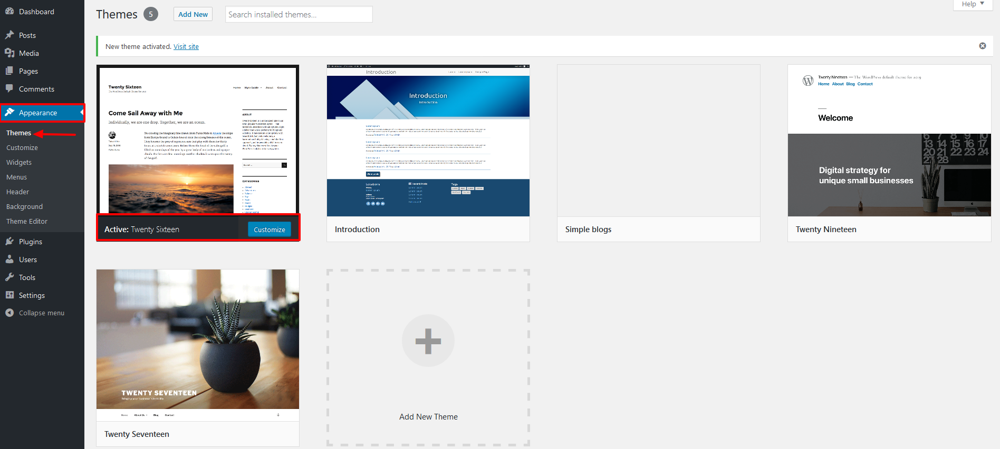

# Basic Theme Configuration

Below is a list of elements found in each learning module, and a brief description of each. When creating a new module, ensure that it contains each of these elements.

## Description

This module will take you through the basic configuration of a theme. There are many that have more complex settings, but in this instance we are using the default theme Twenty-Sixteen and configuring the default settings for WordPress 4.6 and earlier.

## Prerequisite Skills

A bulleted list of skills students require to learn and understand the module:

*   Familiarity with what a theme does
*   Familiarity with WordPress

## Objectives

It’s recommended that you include a bulleted list of objective(s) for each lesson plan. Objectives should be worded as actions that the student can do once they’ve finished. Avoid using words like "know," "understand," "be introduced to," etc.  

*   Students will be able to identify theme settings
*   Students will be able to modify theme settings

## Assets

A bulleted list of linked files/materials the instructor needs to teach the module.

*   WordPress default installation with included default themes

## Screening Questions

A list of evaluation questions for students to see if they have the skills necessary to learn and understand the lesson. These can be used as pre-screening questions on Meetup.

*   Have you ever used WordPress?
*   ???

## Teacher Notes

A bulleted list of any handy tips or information for the instructor.

*   Tips teachers may want to know

## Hands-on Walkthrough

### Getting into the Appearance Area of the Menu

Go to Appearance > Themes and choose the Twenty Sixteen theme.  Click on Customize or go to Appearance > Customize in the menu.  Now you are ready to modify the theme.

### Modify Site Identity

**Your first option, under the choice of theme is Site Identity.**

(the Site Title and Tagline are also located in the Settings > General area on the main menu on the left) **This is the place where you can upload your logo and title your site.**

Then you can upload the files via the WP Add Media dialog sequence.

Upload files from your computer, then select the logo:

**Once you have chosen the logo, change the title and tagline on your site and decide if you want them to display or not.**

You will have the option to crop your image, for this exercise, we will "Skip Cropping." You will now be able to change the Site Title and Tagline by typing into the text boxes.

Next, you can upload a favicon and site icon, making sure your image is 512px square. Click "Select Image" and follow the add media dialog sequence, like you did for the logo above.

Once it is uploaded, you can save the Site Identity section of the customizations

Then click back to the main customization navigation   

### Customizing Color

Chose the Colors menu item

Change Basic Color Scheme or any of the individual colors, then Save & Publish. Leave the Customizing Colors panel by clicking the arrow back.
  

### Background Image

Choose the Background Image Menu item, when the dialog opens, the only option is to Select the background image... Do so! 

Follow the Select Image dialog and upload an image

Once the image is uploaded, there are lots of options.

Background Repeat determines how the image repeats on the background. If you select No Repeat, the image will display one time. Depending on it's size, it will only show at the top left of the background. Tiled, the image will repeat over and over filling the space that is the background. Tiled Horizontally, the image will repeat left to right. Tiled Vertically, the image will repeat top to bottom. In this case, the image I chose was a header image, 1024 px wide. It will cover the width of the image. Background Position determines if the image is aligned Left, Right or Center. In most cases, the background image is tiled, so that it covers the all of the background, but that depends on your preference. Background Attachment determines whether the background stays fixed or if it scrolls with the body copy. Experiment with the settings and decide what works for you. When you are done, click Save & Publish, then go back to the main Customization Menu.

### Editing Menus

Click on the Menu and that will bring you to the dialog that gives you the opportunity to chose menus. 

So far, we have not created menus to choose from so now, we need to create menus. Go back to and out of the customization dialog, by clicking on the back button and then the exit X.

go to the Dashboard and then into the Appearance > Menus dialog

Click the link to create a new menu

Type in a menu name and click the "Create Menu" button

I named my menu "main-menu". Now you can add pages to the new menu.

You can find pages and posts on the left column. Click the box next to the page and then click the "Add to Menu" button.          

## Exercises

These are short or specific activities that test an understand and help you practice certain components of the lesson. They should not be fully scripted exercises, but rather something that you would do on your own. For example, you can create an exercise based on one step of the hands-on walkthrough. **Exercise name** Short description of what the exercise does and what skills or knowledge it reinforces.

*   Short point or step of the exercise
*   And another.

## Quiz

A short quiz for students to evaluate their retention of the material presented. **Write out the question.**

1.  Option
2.  Option
3.  Option
4.  Option

**Answer:** 3\. Correct answer

**How to rename theme name to make it custom theme?**

1.  Rename Theme folder name
2.  Replace theme name in style.css file
3.  Both

**Answer:** 3\. Both

**Which files are required to configure custom theme?**

1.  style.css and page.php
2.  style.css and index.php
3.  index.php and page.php
4.  single.php and page.php

**Answer:** 2\. style.css and index.php
